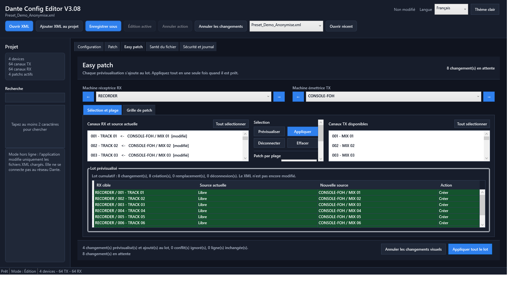

# Dante Config Editor V3.08

[Français](README.md) | **English**

Official V3.08 build for Windows and macOS. Dante Config Editor edits Dante Controller XML configuration files offline.

**Direct downloads: [Windows x64](https://github.com/Mamat79/DanteConfigEditorV3/releases/download/v3.08/DanteConfigEditorV3_08_Installer.exe) | [macOS Apple Silicon](https://github.com/Mamat79/DanteConfigEditorV3/releases/download/v3.08/DanteConfigEditorV3_macOS_AppleSilicon.dmg) | [macOS Intel](https://github.com/Mamat79/DanteConfigEditorV3/releases/download/v3.08/DanteConfigEditorV3_macOS_Intel.dmg)**

> **Status: official V3.08 build for Windows and macOS. Unofficial third-party tool, not affiliated with Audinate.**
> This software may still contain bugs. Older versions are no longer offered for download. Always work on a copy and validate generated XML with official Dante tools.

## Origin and agent-assisted development

Dante Config Editor began as an attempt to fill the gaps I encountered in Dante Controller. It started as a small personal application written manually by Mamat to solve a practical field need: checking a Dante configuration quickly without opening each page of the application in turn. The goal was to provide one overview of devices, latency, sample rates, network modes, Preferred Master state, IP addresses and channels, with the ability to correct preset values when needed.

Renaming on an already patched network was another recurring problem. Changing a device name or TX channel names can require revisiting the affected subscriptions and rebuilding part of the patch. The editor was therefore designed to update recognized XML references during renaming and preserve the patch as far as the preset structure allows.

Finally, the offline workflow available in Dante Controller did not provide the consolidated preparation process required for this use case. Reviewing, editing, merging and preparing a preset without being connected to the Dante network therefore became one of the project's central goals.

Modern development agents then enabled a much larger step forward: safer saving, regression tests, a bilingual interface, self-contained installers, a macOS build, reports and more advanced patching tools. Product needs, functional decisions and field validation remain directed by Mamat; the agents contribute to analysis, implementation, testing and documentation.

## Preview

[](docs/media/easy-patch-v308.png)

**[Watch the bilingual Easy patch demo - 40 seconds (MP4)](docs/media/easy-patch-v308-demo.mp4)**

The screenshot and demo use only a synthetic anonymized preset. They contain no production device name, file or path.

## What the application does

- Opens Dante XML configuration files offline.
- Displays devices, TX/RX channels, latency, network mode and Preferred Master state.
- Renames devices and TX/RX channels, including channel ranges.
- Updates recognized RX subscriptions when a referenced TX channel is renamed.
- Resets channel names.
- Deletes a device and removes recognized subscriptions that reference it.
- Merges devices from a second XML file into the open project.
- Handles duplicate device names with manual or automatic renaming during merge.
- Edits supported audio and network values exposed by recognized XML structures.
- Provides the classic `Patch` view and the Windows `Easy patch` workspace.
- Supports cumulative patch previews, direct apply, strict ranges and explicit conflict handling.
- Displays a compact interactive TX/RX patch matrix with horizontal, vertical and diagonal gestures.
- Opens a device details window to edit formats, IP data, channel names and RX patches.
- Applies global actions only to the selected or locked target scope.
- Resets all RX patches, TX references, or both for a device.
- Saves through a validated temporary file and protects an existing destination with a backup.
- Blocks unexpected changes to protected Dante XML areas.
- Preserves default XML namespaces and recognized unknown values.
- Provides French and English interfaces, quick starts and full PDF manuals.
- Exports TXT/PDF reports and read-only patchbooks.
- Displays file-health warnings, compatibility information and a simple TX-to-RX topology.
- Provides search, recent files, undo, recovery, dark theme and light theme.

## Important limitations

- The application does not control a live Dante network.
- It does not use an Audinate SDK or API.
- It only works on offline XML files.
- It does not bypass Audinate protections or reimplement a proprietary protocol.
- Compatibility depends on the actual structure of the supplied preset.
- Some subscriptions may not be detected if their XML structure is not currently recognized.
- `subscribed_device="."` is treated as a local source on the RX device.
- A missing TX device is reported as a warning because a preset may be partial.
- Dante IDs are preserved; the UI label is `Dante Id`, while the XML attribute remains `danteId`.
- Only a successful import into Dante Controller can provide final compatibility confirmation.

## Download and install

The recommended files are available in the [V3.08 GitHub Release](https://github.com/Mamat79/DanteConfigEditorV3/releases/tag/v3.08).

### Windows x64

Download [`DanteConfigEditorV3_08_Installer.exe`](https://github.com/Mamat79/DanteConfigEditorV3/releases/download/v3.08/DanteConfigEditorV3_08_Installer.exe).

The self-contained installer includes the required .NET 8 runtime, French and English documentation, a Start menu shortcut, destination selection and clean uninstall support. It installs by default in `C:\Program Files\Dante Config Editor V3.08\` and upgrades an existing V3.08 installation.

### macOS

- [`DanteConfigEditorV3_macOS_AppleSilicon.dmg`](https://github.com/Mamat79/DanteConfigEditorV3/releases/download/v3.08/DanteConfigEditorV3_macOS_AppleSilicon.dmg) for Apple Silicon Macs.
- [`DanteConfigEditorV3_macOS_Intel.dmg`](https://github.com/Mamat79/DanteConfigEditorV3/releases/download/v3.08/DanteConfigEditorV3_macOS_Intel.dmg) for Intel 64-bit Macs.

Open the DMG and drag `Dante Config Editor` into `Applications`. The .NET runtime and both language manuals are included.

The macOS builds are ad hoc signed but are not notarized with an Apple Developer account. On first launch, you may need to right-click the application, choose `Open`, and confirm. Verify the published SHA-256 checksum before installation.

## Distributed version

- `main` is the only published GitHub branch.
- `v3.08` is the only retained tag and Release.
- The Release contains one Windows installer and two macOS DMGs.
- Functional history remains available through the commits and `CHANGELOG_V3.md`.

## Quick start

1. Launch the application.
2. Select `Open XML` and choose a copy of a Dante configuration file.
3. Review detected devices and warnings.
4. Make the required changes.
5. In `Easy patch`, choose RX and TX devices and preview a selection or range.
6. Repeat as needed; previews accumulate without changing the XML.
7. Select `Apply the whole batch`, or use direct apply for the current operation.
8. Save under a new name.
9. Import and validate the result in the appropriate official Dante tool before production use.

## Easy patch in V3.08

- RX devices and channels are displayed on the left; TX sources are on the right.
- Previous/next controls make it quick to move between devices.
- `Ctrl` and `Shift` provide independent multi-selection in TX and RX lists.
- Equal TX/RX selections are paired one-to-one.
- One TX may feed multiple RX channels.
- Multiple TX sources cannot be assigned to one RX channel.
- Range patching uses a first TX, first RX and exact channel count.
- Oversized or ambiguous ranges are blocked atomically.
- Every preview joins one cumulative pending batch.
- The XML remains unchanged until the whole batch is applied.
- Existing subscriptions require an explicit replace, skip or cancel decision.
- The matrix uses compact cells and full TX names are available in tooltips.
- Horizontal gestures prepare consecutive TX/RX pairs.
- Vertical gestures feed one TX into several RX channels.
- Exact diagonals prepare one-to-one series.
- The final operation creates one undo step.

## Build from source

Requirements:

- Windows for the WPF application and installer
- .NET 8 SDK
- Inno Setup 6 for the Windows installer

Build the application:

```powershell
.\build.ps1
```

Build the self-contained Windows installer:

```powershell
.\installer\build_installer.ps1
```

Run all automated test suites:

```powershell
.\tests\run-tests.ps1
```

The macOS packaging process is documented in `MACOS_BUILD.md`.

## Validation and maintenance

- `TESTING.md`: automated results and validation history.
- `COMPATIBILITY_MATRIX.md`: evidence level for recognized XML structures.
- `MANUAL_DANTE_CONTROLLER_TESTS.md`: checklist for real imports.
- `ACCESSIBILITY.md`: completed and remaining accessibility checks.
- `KNOWN_LIMITATIONS.md`: technical and distribution limitations.
- `ARCHITECTURE_REFACTORING.md`: progressive architecture work.

## File safety

- Always work on a copy.
- Do not overwrite a production preset without testing.
- Keep automatically generated backups.
- Validate the final file in official Dante tools before deployment.
- The application checks generated XML consistency, but a real Dante Controller import remains the final validation.

## Public repository

https://github.com/Mamat79/DanteConfigEditorV3

## Credit

**By Mamat**<br>
<sub>et ses agents</sub>
